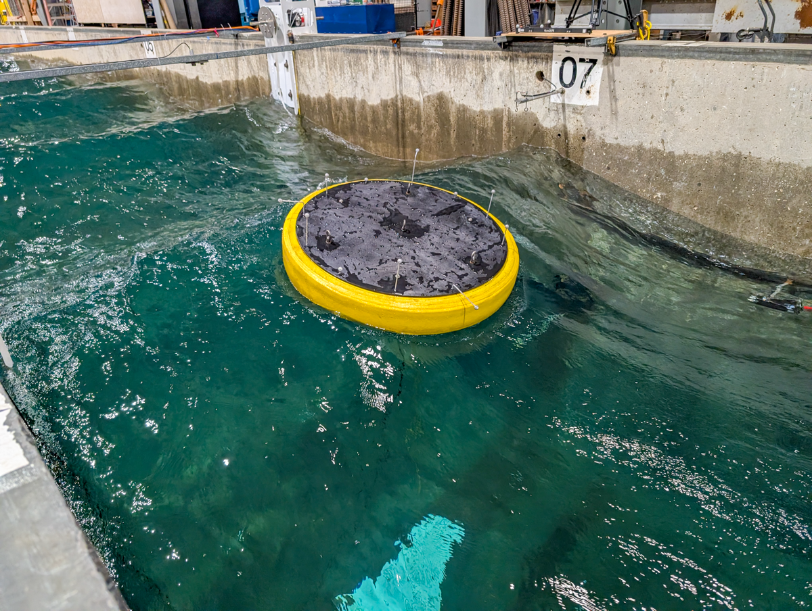

**Hybrid Mooring** Testing of SubWEC device as a surface following WEC device moored with SubWEC PTOs used to simulate realistic mooring systems

Duration: Winter 2025-2026

Facility: LWF

Conditions tested: Regular waves

Goals:

* Demonstrate Real Time Hybrid Simulation applied to WEC mooring system
    + Use SubWEC float and PTO as actuator

