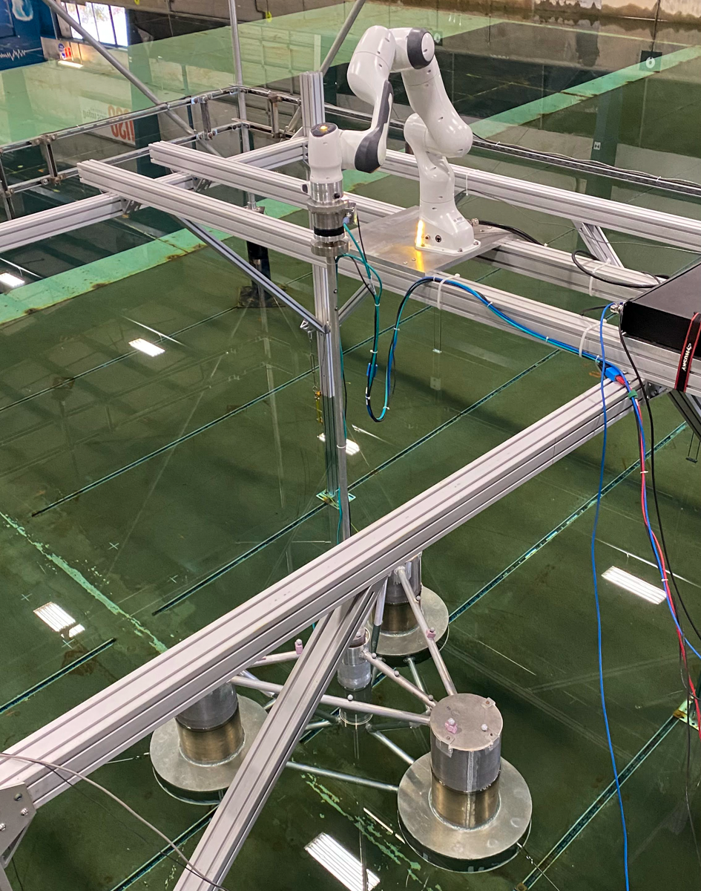

**HybridWind4** Testing of Semi-submersible wind turbine platform in waves with robotic arm actuating wind forces on top of turbine mast

Duration: Summer 2024

Facility: DWB

Conditions tested: Regular and Random waves

Goals:

* Demonstrate Real Time Hybrid Simulation applied to floating offshore wind system
    + Use robotic arm to actuate forces calculated in openfast and scaled to tank scale

