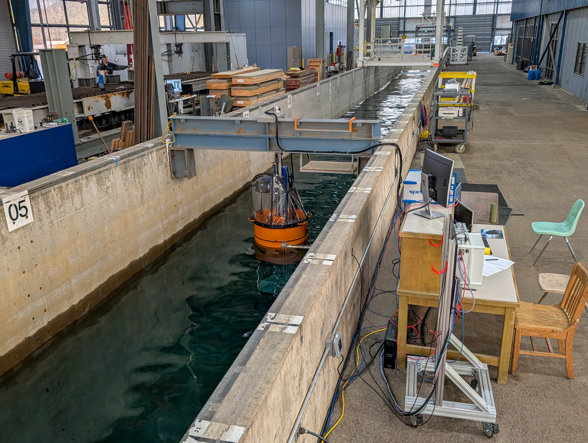

**LUPA7** Testing of LUPA in the large wave flume (LWF).  Collecting system identification and validation data for EWTEC 2025 conference paper.

Duration: Spring 2025

Facility: LWF

Conditions tested: Multisine reference input; Regular waves

Goals:

* Collect System Identification data for applying impedance matching model
    + Still water multisine reference signal input
    + Regular wave validation runs

