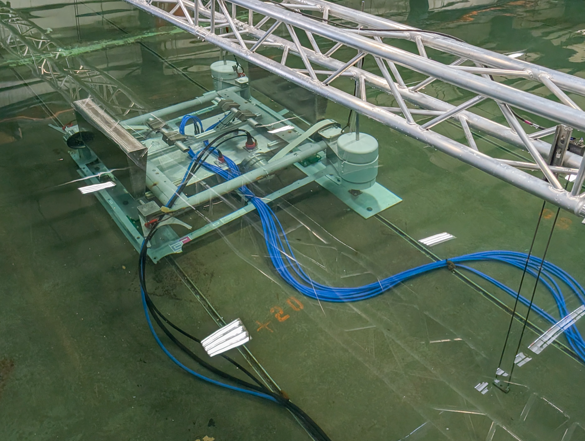

**NAVFACOSWECS** Testing of FOSWEC in the directional wave basin (DWB).  First tested UW OSWEC, then fixed FOSWEC at different platform angles to simulate beach slopes, three water depths, and regular and random waves.

Duration: Summer 2026

Facility: DWB

Conditions tested: Regular and Random waves

Goals:

* OSU - record mechanical and electrical power generation
* OSU - test impact of water depth on power production
* OSU - test impact of inclination on power production
* OSU - test impact of wave conditions on power production

