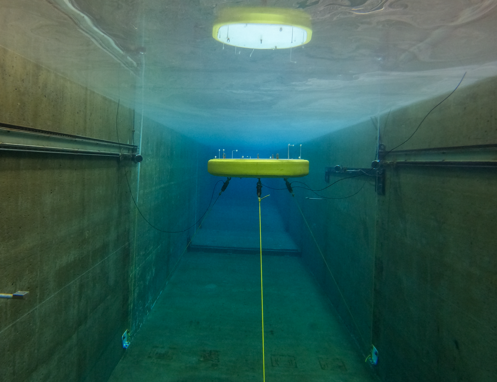

**SubWEC** Testing of SubWEC device in 1 and 3 tether mode

Duration: Spring 2024

Facility: LWF

Conditions tested: Regular and Random waves

Goals:

* Test SubWEC device in single and three tether mode with two tethers onshore and one onshore
    + Test different depths and damping

