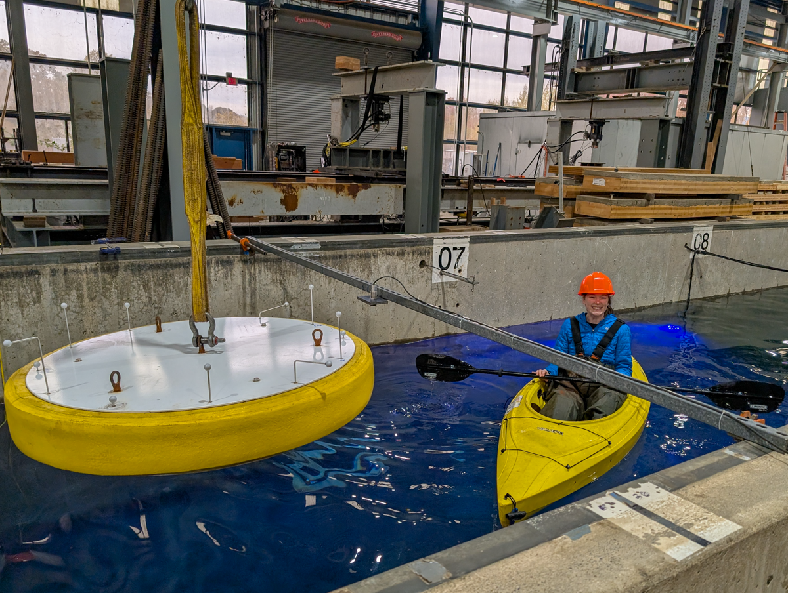

**SubWEC2** Testing of SubWEC device in 3 tether mode

Duration: Fall 2025

Facility: LWF

Conditions tested: Regular and Random waves

Goals:

* Test SubWEC device in three tether mode with two tethers offshore and one onshore
    + Test different depths and damping

