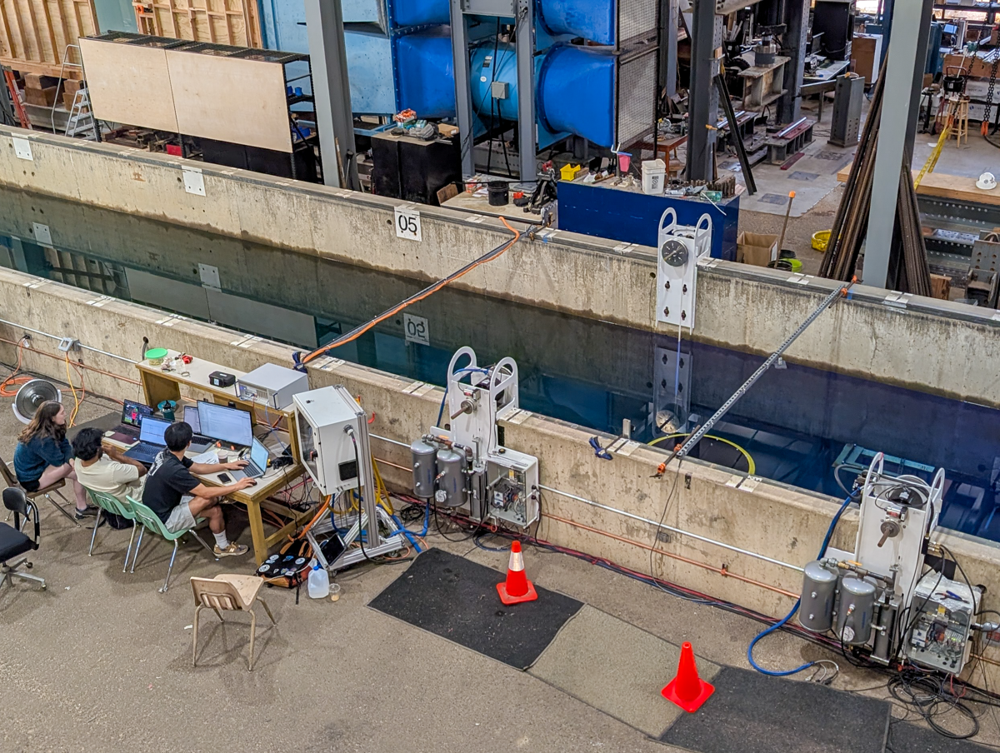

**SubWEC3** Testing of SubWEC in the large wave flume (LWF).  Tested original SubWEC shape as well as Cake WEC and Wing WEC geometries.

Duration: Summer 2026

Facility: LWF

Conditions tested: Regular and Random waves

Goals:

* Test different WEC shapes
* Test control techniques

