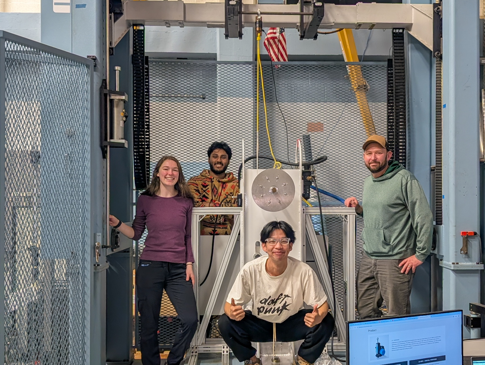

**SubWEC_WESRF2** is a test campaign in the WESRF laboratory on the Linear Test Bed(LTB).  Students Inyong Kim and Tanvir Alam Shifat are testing real time control algorithms related to WEC control and LTB control. 

Duration: 3/2026-?

Facility: WESRF Linear Test Bed

Goals:

* Real-time control of Linear Test Bed integrating WEC-Sim
* Real-time control of WEC PTO with dynamic damping control

