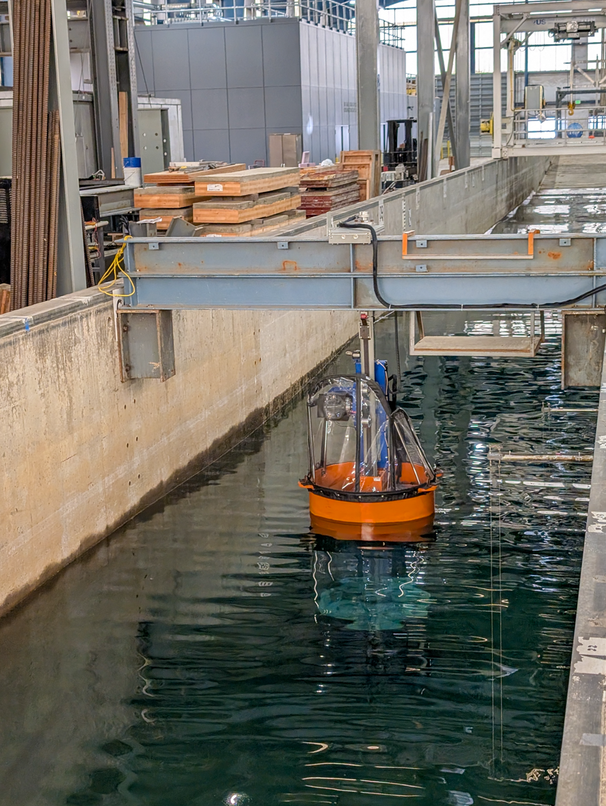

**TEAMERAOELUPA6** Software emulation of pneumatic compressed air system with forces actuated on LUPA

Duration: Spring 2025

Facility: LWF

Conditions tested: Regular and Random waves just charging capacitors and charging batteries

Goals:

* Demonstrate emulation of compressed air system with LUPA
    + Use motor/generator on LUPA to actuate force outputs from pneumatic model

