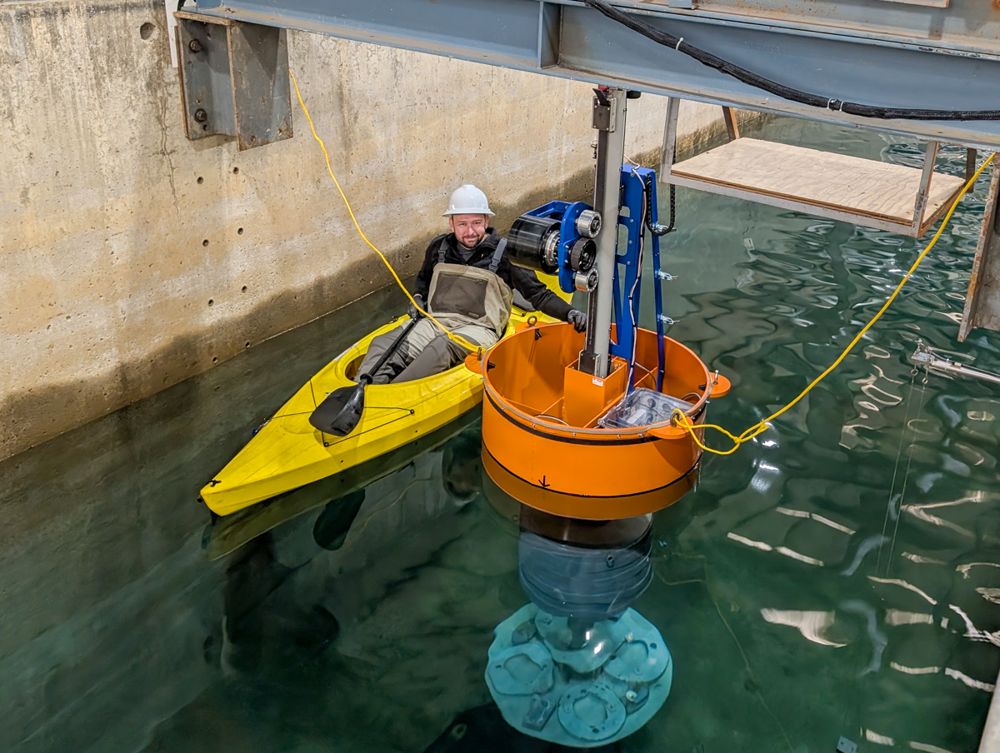

**TEAMERMTULUPA5** is a project using deep reinforcement learning to optimize power output from the LUPA device.

Applicant: Shangyan Zou - Michigan Tech University

Duration: Winter 2025-2026

Facility: Large Wave Flume

Wave Condition: Regular and random waves

Goals:

* Deep reinforcement learning algorithm applied to LUPA to maximize power generation

