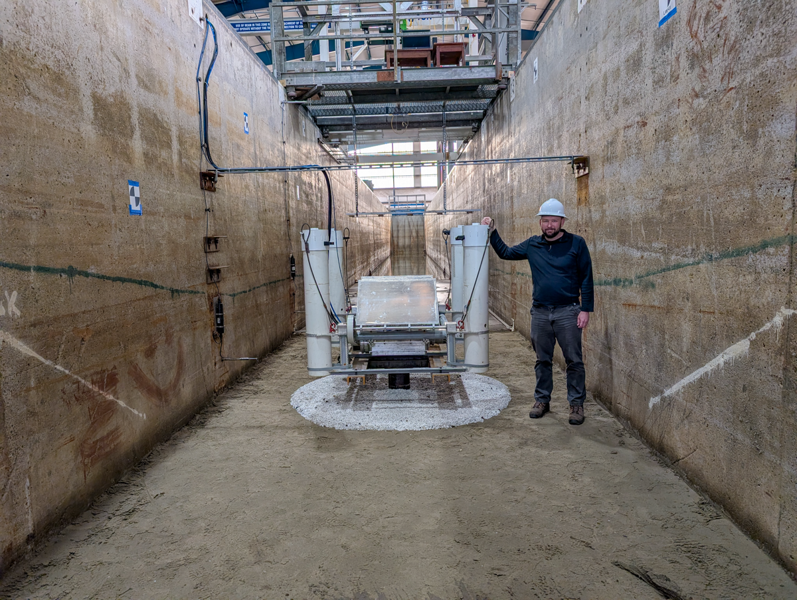

**TEAMERScour** is a scour project in the flume with a sandpit and FOSWEC with the applicant a PhD student from the University of Porto, Portugal.

Duration: 12/29/2025 - 2/13/2026

Facility: Large Wave Flume

Wave Condition: H = 0.5 m, T = 3.2 s, Jonswap

Goals:

* comparisons of scour patterns for different protections
    + just sand
    + cylinder
    + different protections
    + FOSWEC
        - active
        - fixed

