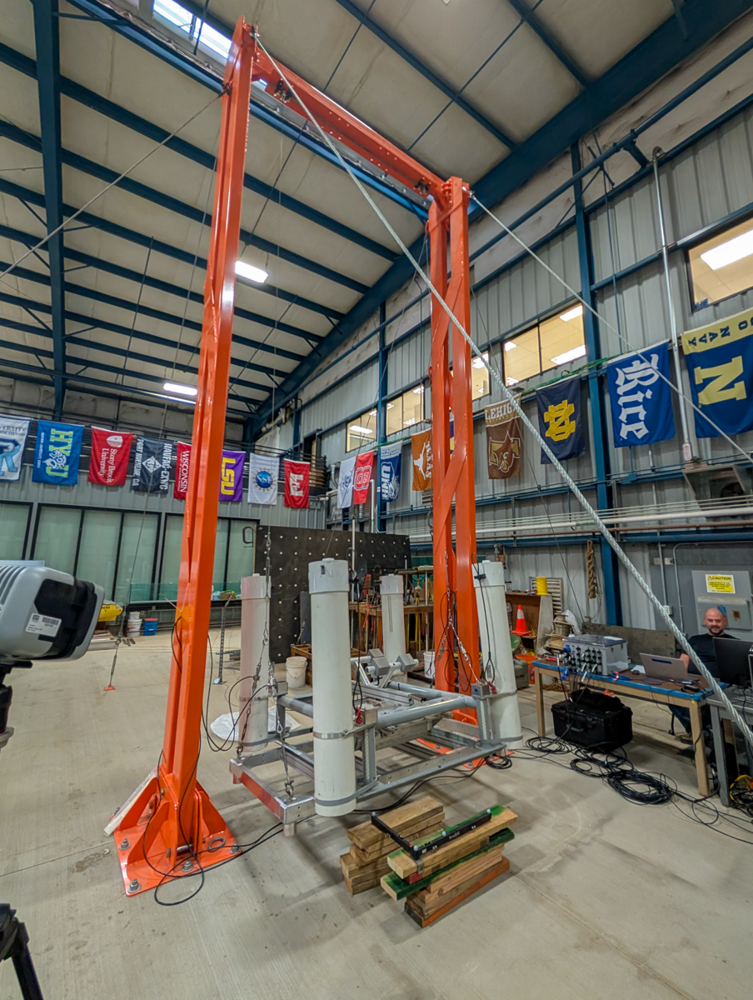

**UHDryFOSWEC** is a project demonstrating static and swing tests on FOSWEC.  Load cells on swing lines used to determine mass properties.  Swing tests used to estimate moments of inertia. 

Duration: August 2025

Facility: Swing; FOSWEC; Qualisys

Conditions tested: mass properties; moments of inertia

Goals:

* Dry test FOSWEC to determine mass properties and moments of inertia  
    + Swing tests using Qualisys motion tracking

