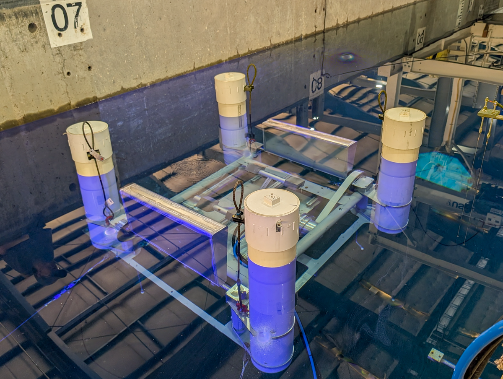

**UHFOSWEC** is a project demonstrating FOSWEC as a submerged WEC in the Large Wave Flume.  Depths of submergence was controled with a three point tension mooring system

Duration: September 2025

Facility: Large Wave Flume; FOSWEC

Conditions tested: regular, random, free decay

Goals:

* Test FOSWEC at multiple depths of submergence.  
    + Provide dataset to validate numerical model

