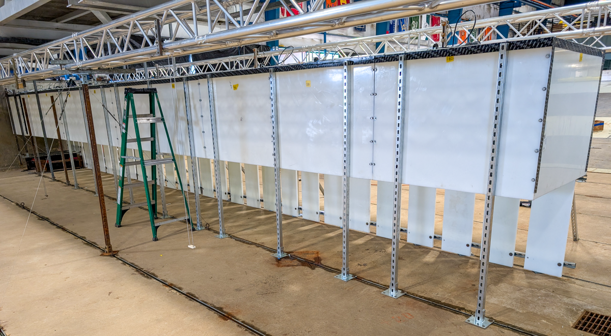

**OHOWCBarrier** TEAMER testing of OWC-integrated breakwater. Multiple chambers and various PTO examples.

Duration: Spring 2025

Facility: DWB

Conditions tested: Regular and Random waves

Goals:

* Test novel slotted breakwater OWC design with various PTO outputs

