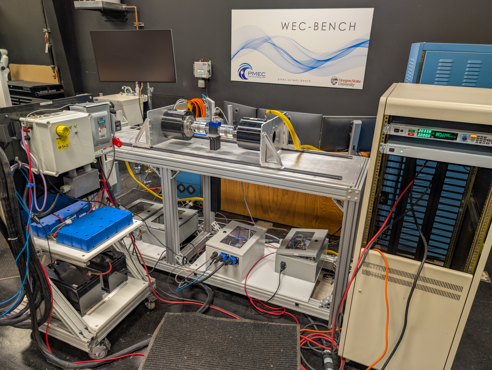

**WECBench** is the initial checkout of the new PMEC facility funded under the IIJA grant.  First application was a checkout of the LUPA PTO configured for the mCDR project.  Charging of the supercapacitor bank from 150V to 300V.

Duration: 2025 - 2026

Facility: PMEC Laboratory WEC-Bench

Conditions tested: amplitude = 90 deg period = 1.8 s and 225 deg, T = 2.5 s

Goals:

* Checkout of DC power supply, power analyzer, and charging of capacitor bank with generator
    + Efficiency
        - comparing average power at different stages of the conversion chain
    + Sankey diagrams

