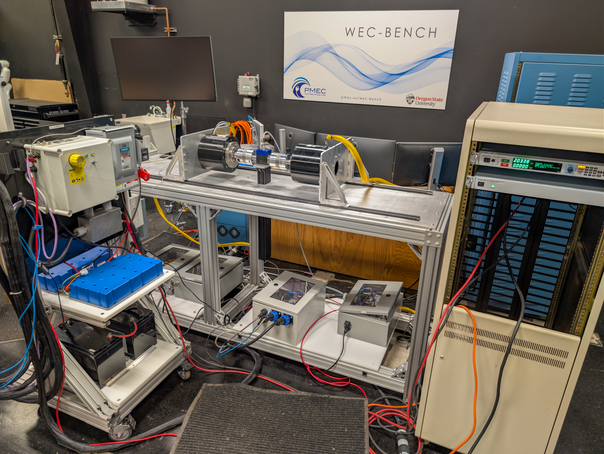

**WECBench mCDR** Testing of the complete mCDR system to be deployed on LUPA.  Combined testing of Generator, drive, supercapacitor bank, charge controller, battery, buck conveter, and dummy load.

Duration: Winter 2025 - Spring 2026

Facility: PMEC Laboratory WEC-Bench & LUPA motor and power electronics

Conditions tested: various amplitudes and periods

Goals:

* Checkout of supercapacitor bank, charge controller, battery, buck converter, and dummy load
    + Process for saving charge controller data
    + Measurement of power into load (current shunt and voltage measurements)
    + Dummy resistor tested with 5 V, ~4 A, ~20 W 

