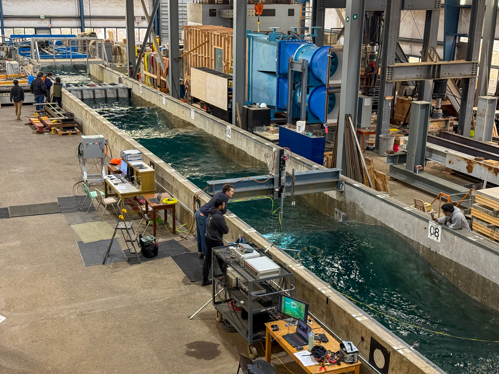

**WECAUV4** is a project demonstrating docking of an AUV in the large wave flume as well as real time control of an actuator simulating the motions of a WEC.

Duration: October 2025

Facility: Large Wave Flume; Linear Actuator; AUV

Conditions tested: regular, random, and no wave cases

Goals:

* Checkout of linear acuator control system for mimicing WEC motion under various wave conditions
    + WEC-AUV docking
        - Docking excercises under various wave conditions

